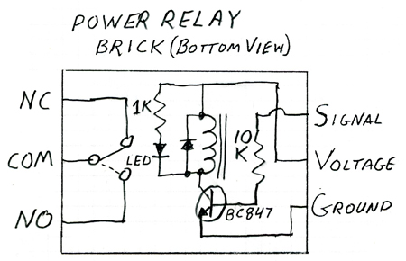
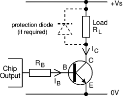
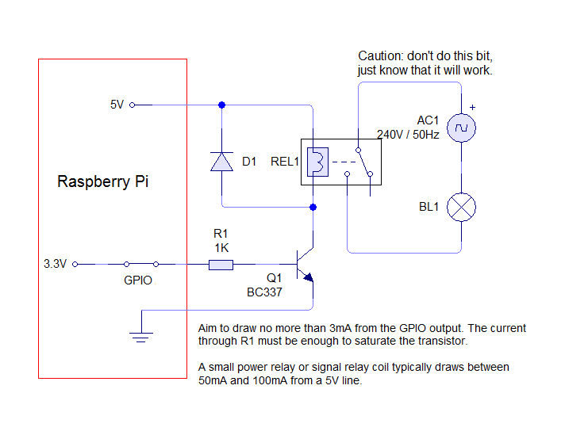
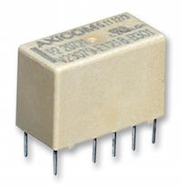
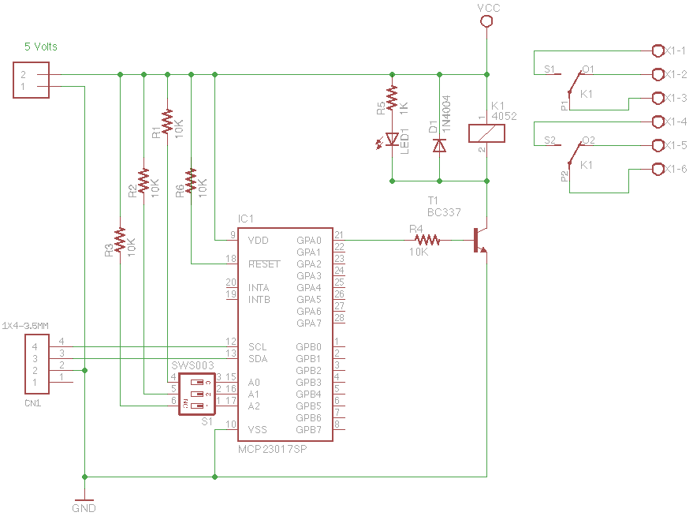

# gaw_Rasp_I2C_16_Relays
I2C 16 relay board for use with RPi

# Using the Raspberry Pi in model railroading

## The problem
There's a lot of switching to do on a model railroad (pun intended). In a DCC environment we must be able to switch DCC block waves of 15 to 25 Volts / 1 to 2, sometimes even 3 Amps. The Raspberry Pi can not switch this kind of power by itself.

### I/O expander
Purpose of my project is to create an add-on board with which we can switch DCC power (an other stuff) with 16 relays. These circuits will be controlled using a `MCP23017`, an I2C 16 channel I/O expander chip. This chip can be made to work at one of eight possible adresses on the I2C bus. This means that, when we indeed would use aight of these boards, we could control a maximum of 128 ralays via only the two wires od the I2C bus!

### Relays
A solution to solve the insufficient power of the Raspberry Pi is to control relays. This presents us with a challenge, because most relay coils take (much) more power than the Raspberry Pi can muster up from its 3,3 Volt outputs.

I will choose relays that will work on 5 Volts DC because the other availbale add-on boards also work on 5 Volts. The voltage of the logic chips (3,3 Volts) must be converted to the appropriate leven of 5 Volts. Below you will find a number of solutions I found on the internet. Mostly they use transistors as switches to do the conversion, controlled by a Raspberry Pi output pin.

#### Protection
Even with the transistor, the output of the logic chips has to be protected against to high of an output current. This is done by using a base-resistor that will be placed between the output of the logic chip and the base of the transistor. A value of a couple of K to 10K is recommended. Should this resistor not be present, there would be a short between de 3,3V output of the logic chip and GND (0V) through the transistor. This would end in the untimely demise of (the output of) the logic chip and most likely the transistor as well.

#### Transient Voltage Suppressor Diode
Another thing the circuit needs is a protection against the hysteresis effect. This is the effect that happend when you switch off power going through a coil. When you switch off the relay, its coil will produce a short spike in voltage. To protect the circuit against this, we use an anti-parallel diode that shorts this voltage spike over the coil so that it does not reach the rest of the circuit.

#### LED indicator
A nice little extra would be to have an indicator LED to tell us when a relay is activated or not. We can place this LED, in series with a resistor, parallel over the relay coil. See also figure 1, the Arduino-info.

## Solutions

### Arduino-info wikispaces
The idea you can see in this drawing could be found in [this article](https://arduino-info.wikispaces.com/ArduinoPower) of arduino-info.wikispaces. As you can see, a transistor is mentioned here,the BC847, but that's an SMD version. That's not so easy to solder in for 'old school' hobbyists like me. For the base resistor we see a value of 10K.

### Electronics Stack Exchange
Another solution is the one I found at Stack Exchange, also uses a transistor. The picture velow comes from [this article](http://electronics.stackexchange.com/questions/56093/how-to-use-a-3v-output-to-control-a-5v-relay) at electronics.stackexchange. This one does not specify values for the components (resistor and diode).

### Susa net
Yet another, similar solution comes from susa.net. See the picture below, belonging to [this article](http://www.susa.net/wordpress/2012/06/raspberry-pi-relay-using-gpio/). Again, a transistor is used: a BC337. The resistor gets a value of 1 Kilo Ohm; the article text says to be strict and wanted to stay below 3mA, this value should actually be 1,2K. The current then will be 2,75 mA.

## Components

### Relay
At our local electronics shop, Okaphone, I found [this relay](http://www.okaphone.com/artikel.asp?id=474062), article number `V23079-A1001-B301` (€6,95). With its 5 Volt coil-voltage, it can switch 2 Amps with 250 Volts AC or 220 Volt DC. See picture below:

[At another shop (Farnell) the same relay could also be found](http://nl.farnell.com/te-connectivity-axicom/v23079-a1001-b301/relay-dpdt-5vdc-2a-tht/dp/4219960), only there it would set us back only €2,72.

In the end I got - apart from the usual good advice - my relays for a good (lower) price.

### Transistors
Possibilities that were mentioned are:

* 'BC337', traditional
* 'BC547', same, but can only work max. 100mA
* 'BC847', SMD, no good.

### Diode
Which diode we use actually does not matter that much, the standard diode `1N4007` will suffice.

## Summary
I will choose for:

* `V23079-A1001-B301` relay
* `BC337-16` (Old school, €0,20) 
* `1N4007` as TVS diode (€0,10)
* 10K base resistor (€0,01)
* 1K resistor protecting the current for the indicator LED (0,01)
* green indicator LEDs `L934LGD` - current up to max 5mA (€0,20)

Furthermore I need:

* `MCP23017-E/SO` I2C 16 bit I/O expander (€2,45)

## Update
In a later stage I discovered a far more elegant solution. There is a chip, the `ULN2803A`, that can drive eight relays using an internal `darlington` circuit and also contains an internal TVS diode. I upgraded my schematic accordingly.

## Schematic
My schematic now will be:

