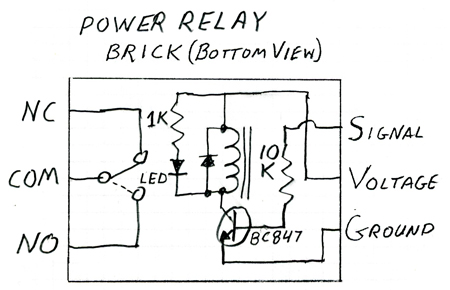
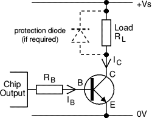
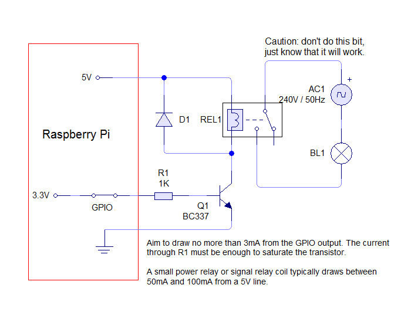
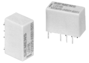
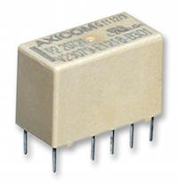

# Gebruik van de Raspberry Pi bij modelspoor

## Het probleem
Op een modelbaan heb je al snel veel te schakelen. In een DCC modelbaan omgeving moeten we in staat zijn om DCC (15 tot 25 Volt blokspanning) te schakelen. De Raspberry Pi kan niet zomaar dit soort spanningen schakelen. 

### I/O expander
Het doel van dit project is om een 'add-on board' te maken waarmee met behulp van één board 16 maal zo'n (DCC) spanning te schakelen is. Die schakelingen wil ik aansturen met een `MCP23017`, een I2C 16 channel I/O expander chip. Deze chip heeft als eigenschap dat je hem op acht verschillende adressen op de I2C bus kunt laten werken. Dat betekent dan dat je, als je inderdaad acht van deze 'add-on boards' gebruikt, 128 relais mee kunt aansturen via de twee draden van de I2C bus.

### Relais
Een oplossing voor het onvoldoende vermogen van de Raspberry Pi is om direct, of indirect via andere chips die 3,3 Volt leveren, een relais aan te sturen. Ook daarbij is er nog een uitdaging, want ook relais-spoelen onttrekken (veel) meer stroom dan een logische 3,3 Volt uitgangspin kan leveren. Ook andere chips van dit (logic) niveau leveren niet het benodigde vermogen. 

Ik kies hierbij voor relais die werken op 5 Volt. Deze keuze maak ik omdat ook andere 'add-on boards' met 5 Volt worden gevoed. De uitgangsspanning van de logic chips (3,3 Volt) moet dan worden omgezet naar de 5 Volt die het relais nodig heeft. Hieronder vind je een aantal schakelingen als resultaat van wat Googlen. Er wordt gebruik gemaakt van een transistor als schakelaar, die onder besturing van de uitvoer-pin van de Raspberry Pi of van een aangesloten chip de stroom schakelt die het relais nodig heeft.

#### Bescherming
Maar ook met die transistor erbij, moet de uitgang van de gevoelige logic chip worden beschermd tegen te hoge stroomafname. Dat doen we met een zogeheten basis-weerstand, een weerstand die tussen de uitgang van de chip en de basis van de transistor wordt geplaatst. Een waarde van een paar K tot 10K wordt aangeraden. Zou die er niet zijn dan zou er, via de transistor, kortsluiting ontstaan tussen de 3,3V van de uitgang en de GND (0 Volt).

#### Spanningspiek 'blussen'
Bij het uitschakelen geeft een relais een relatief hoge spanningspiek. De rest van de schakeling wil je hiertegen beschermen, dat doe je met een zogeheten blusdiode. Deze blusdiode wordt antiparallel aan de relais-spoel geschakeld, om die uitschakel-stroom terug te voeren aan de spoel, zodat deze niet in de rest van de schakeling terecht komt.

#### LED indicator
We kunnen ook een indicatie-LED toevoegen die ons vertelt dat het relais geactiveerd is. Die plaatsen we, in serie met een weerstand, nu niet anti- maar gewoon parallel aan de relais-spoel. Zie figuur 1, bij Arduino-info.

## Oplossingen

### Arduino-info wikispaces
Dit idee is te vinden in deze tekening uit [dit artikel](https://arduino-info.wikispaces.com/ArduinoPower) van arduino-info.wikispaces. Zoals je kunt zien, wordt hier een transistor genoemd, namelijk de BC847, maar dat is een SMD versie. Niet zo gemakkelijk te solderen voor 'old school' hobbyisten als ik. Voor de basisweerstand wordt hier een waarde van 10K gegeven.

### Electronics Stack Exchange
Een andere oplossing, die ik vond op Stack Exchange, maakt ook gebruik van een transistor. De afbeelding hieronder komt uit [dit artikel](http://electronics.stackexchange.com/questions/56093/how-to-use-a-3v-output-to-control-a-5v-relay) van electronics.stackexchange. Dit artikel geeft geen waardes voor de componenten (weerstand en diode).

### Susa net
Een andere, soortgelijke oplossing komt van susa.net. Zie de afbeelding hieronder die hoort bij [dit artikel](http://www.susa.net/wordpress/2012/06/raspberry-pi-relay-using-gpio/). Zoals je ziet wordt ook hier een transistor genoemd: een BC337. Ook de weerstand krijgt een waarde: 1 Kilo Ohm; de tekst van het artikel geeft hierbij aan dat, als je strikt wilt zijn en onder 3 mA wilt blijven, je deze waarde moet verhogen naar 1,2K. De stroom wordt dan 2,75 mA.

## Componenten

### Relais
Ik vond bij Okaphone [dit relais](http://www.okaphone.com/artikel.asp?id=474062), artikelnummer `V23079-A1001-B301` van €6,95. Deze kan, met een 5 Volt spoel-spanning, 2A schakelen aan 250 Volt AC of 220 Volt DC. Zie ook deze afbeelding:

[Bij Farnell was ditzelfde relais ook te vinden](http://nl.farnell.com/te-connectivity-axicom/v23079-a1001-b301/relay-dpdt-5vdc-2a-tht/dp/4219960), maar dan voor €2,72.

### Transistoren
Genoemde mogelijkheden zijn:

* 'BC337', traditionele behuizing
* 'BC547', idem, maar levert max. 100mA, dus net te laag
* 'BC847', SMD, valt af.

### Diode
Maakt eigenlijk niet zoveel uit, de standaard diode `1N4007` volstaat.

## Conclusie
Ik ga na advies van Okaphone kiezen voor:

* het `V23079-A1001-B301` relais, 5V spoelspanning, met een spoel impedantie van 187 Ohm:
* de `BC337-16` (Old school, €0,25) 
* de `1N4007` als 'blus-diode' (€0,15)
* een 10K basisweerstand (€0,01)
* een 1K weerstand voor stroombegrenzing voor de indicatie LED (0,01)
* een groene indicatie LED `L934LGD` - stroom tot 5mA (€0,25)

Verder nodig:

* `MCP23017-E/SO` I2C 16 bit I/O expander (€2,45)

